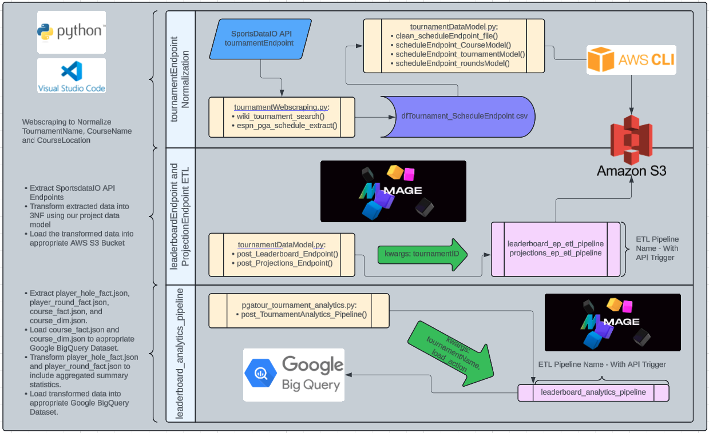
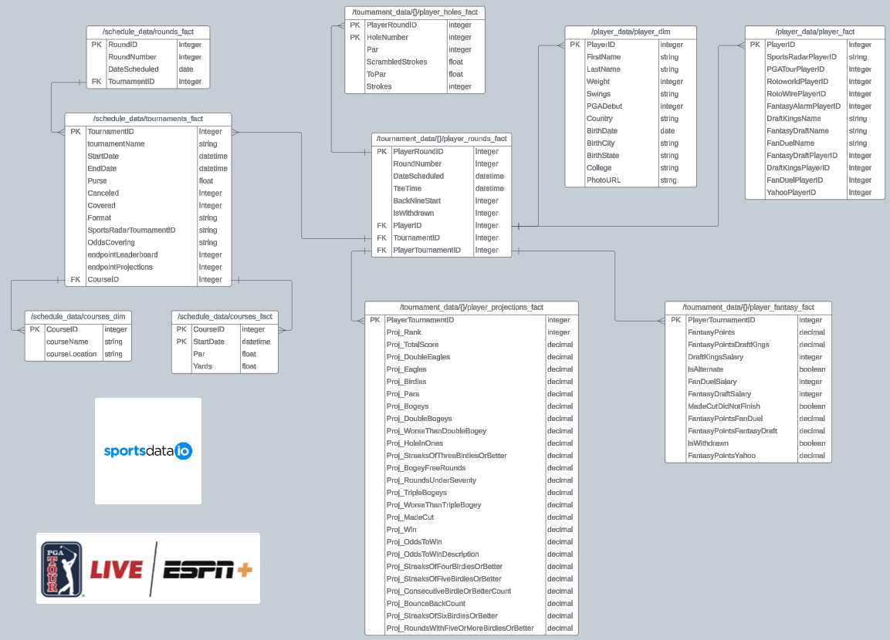
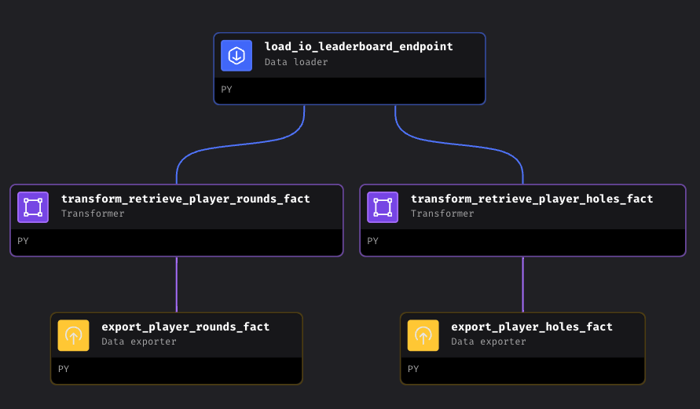
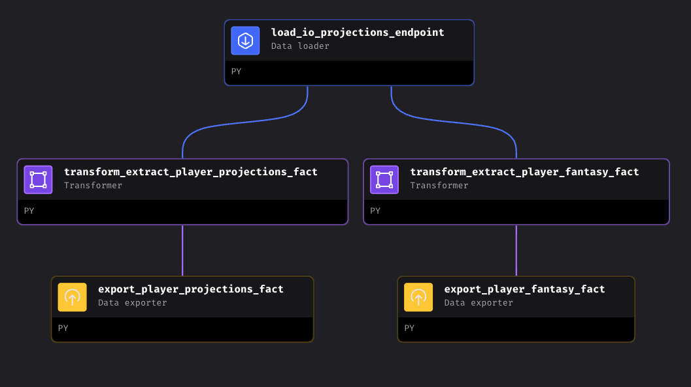
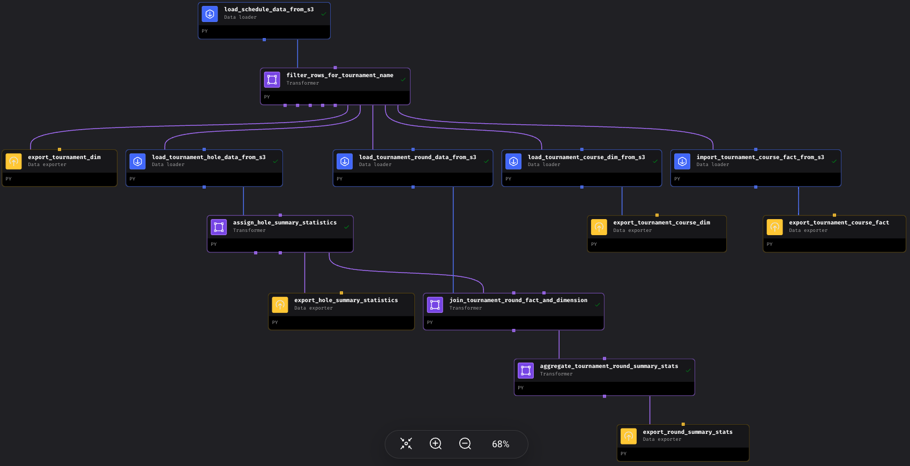

# End-to-End PGA Tour Data Engineering Project

## Introduction

The primary goal of this project is to act as an outlet for me to showcase my current skills as a data specialist and continue exploring/learning the modern data stack, as I transition from data scientist to data engineer. With that said, this project will be part of a phased approach.  

The goal for this phase of the project is to:
1. **tournamentWebscraping.py:** Build out an automated webscrapping process to standardize PGA Tournament Names, PGA Course Names and PGA Course Locations to get data into 3NF and load to AWS S3.  
2. **tournamentDataModel.py:** Build an ETL Pipeline to extract PGA Tournament Leaderboard and Projection Data, transform data into 3NF and load to AWS S3.  
3. **tournamentAnalytics.py:** Build an Analytics ETL Piepeline to extract historical PGA Tournament Leaderboard Data from AWS S3, transform to aggregate player round and tournament scores and statistics, and load to Google BigQuery.  

## Architecture

## Technology Used

- Python  
  - BeautifulSoup and Selenium for webscraping  
- AWS CLI and AWS S3
- Mage-AI: https://www.mage.ai/
- Google BigQuery

## Datasets Used

For this project, we will be leveraging data from SportsDataIO's various API Endpoints, see below.

The data that we are using for this project has been partially scrambled, meaning they are not reflective of the true data captured during the respective events. Tournament and Player details have not been scrambled, but scores, betting odds, projections, rankings, etc. have all been scrambled. For this purpose, the (1) and (2) objectives of this project will ensure data analyzed is reasonable, and acceptable.    

With that said, the endpoints used in this phase are:
- Schedule Data: https://api.sportsdata.io/golf/v2/json/Tournaments?key=  
- Player Data: https://api.sportsdata.io/golf/v2/json/Players?key=  
- Tournament Leaderboard Data: https://api.sportsdata.io/golf/v2/json/Leaderboard/{tournamentid}?key=  
- Tournament Projection Data: https://api.sportsdata.io/golf/v2/json/PlayerTournamentProjectionStats/{tournamentid}?key=  

For more information on the API Endpoints used in this project see the following resources:
- SportsDataIO Website: https://sportsdata.io/  
- API Endpoint Data Coverage: https://sportsdata.io/developers/coverages/golf  
- API Documentation: https://sportsdata.io/developers/api-documentation/golf  

## Data Model

## Pipeline Orchestration

Pipeline code, and Pipeline development environment details can be found in ./mage_pipelines

### leaderboard_ep_etl_pipeline

### projections_ep_etl_pipeline

### leaderboard_analytics_pipeline

## Next Steps

Now that the first phase of the project is complete, Phase2 Goals will consist of:  
1. Implement data models using dbt, data build tool, into the Analytics Pipeline. I have already begun building out various dbt models, see the .sql files in ./models.  
2. Implement CDC (Change Data Capture) to orchestrate the process of keeping the AWS S3 Bucket current with the results of future PGA Tournaments in the /schedule_data/tournament_fact file in the AWS S3 Bucket.  

## Acknowlegements

During this project there were a few modern Data/Big Tech Content creators whose content was instramental in facilitating my learning for this project.  
- Darshil Parmar's YouTube Page: https://www.youtube.com/@DarshilParmar  
- Darshil Parmar's LinkedIn Page: https://www.linkedin.com/in/darshil-parmar/  
- Zach Wilson's LinkedIn Page: https://www.linkedin.com/in/eczachly/  